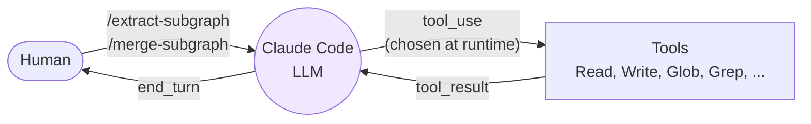
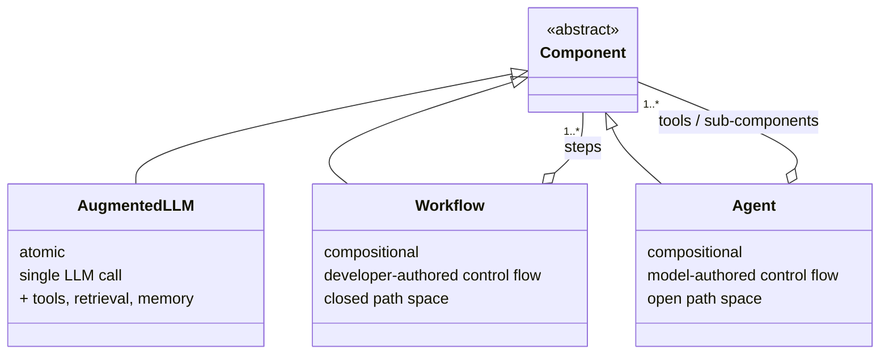
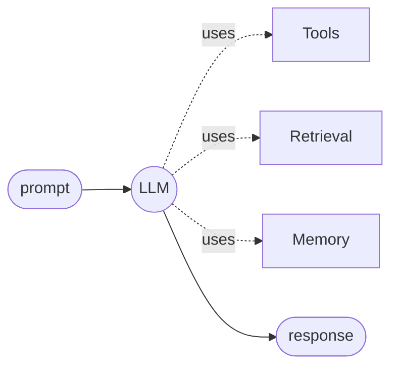
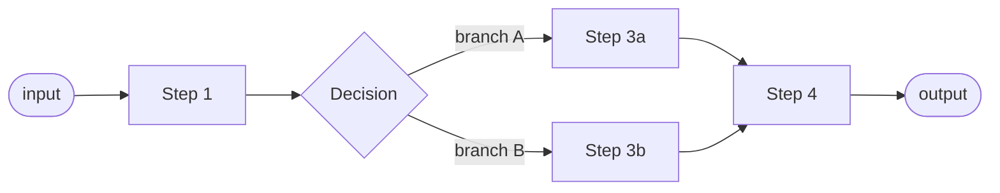
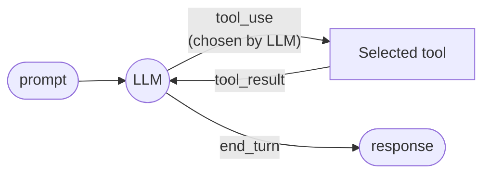
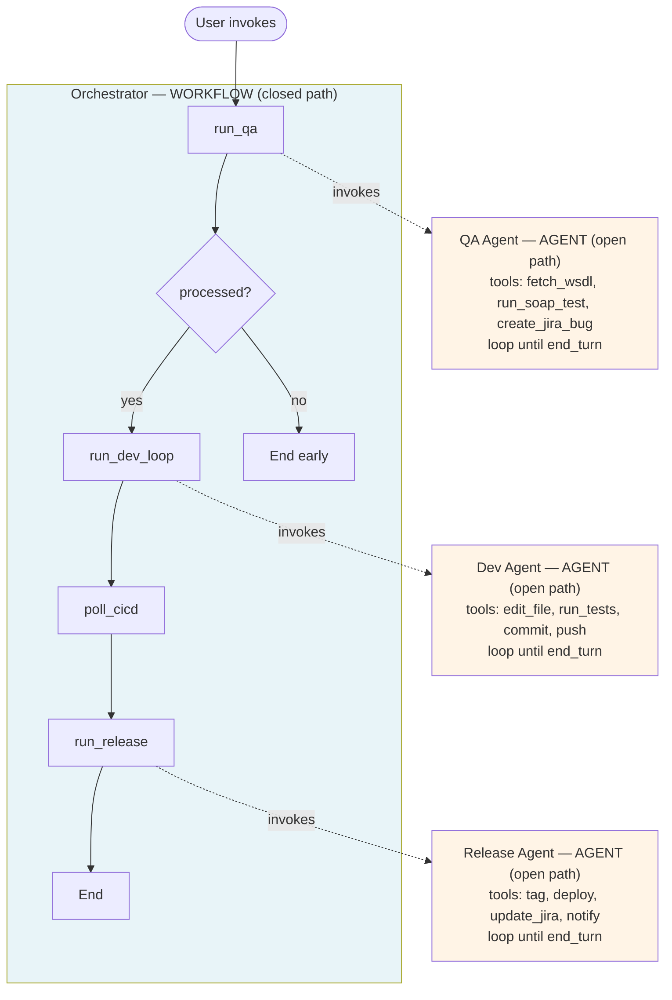
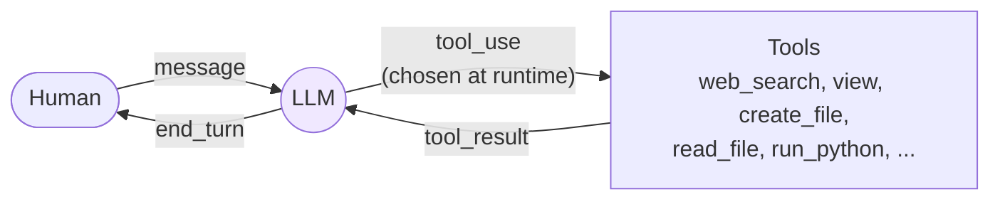
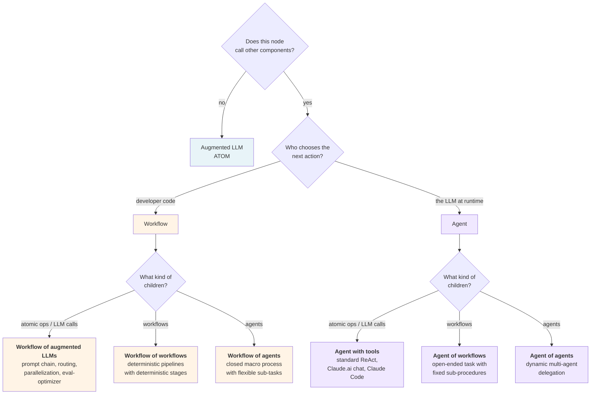

# kb-agent

A personal knowledge management tool built around a DAG (directed acyclic graph). It is classified as an **Agent with tools** — the simplest and most common production shape.

## Demo recording

[demo_kb_agent.mp4](https://ai-maxxing.cc:8443/_work/demo_kb_agent.mp4)

## What the project does

The user builds up a knowledge graph incrementally:

1. `/extract-subgraph` — given a block of input text, Claude extracts key concepts as nodes and their relationships as edges, and writes the result as a subgraph JSON file.
2. `/merge-subgraph` — Claude reads the extracted subgraph and merges it into the main DAG (`data/nodes.json` + `data/edges.json`), resolving synonyms to avoid duplicates.
3. A localhost webapp (`server.js` + `public/index.html`) provides a manual CRUD interface to view and edit the graph directly.

## Why it is "Agent with tools"

The schema's classification tree has three questions:

- **Q1 — Does this node call other components?** Yes: Claude Code reads files, writes files, and reasons over their contents.
- **Q2 — Who chooses the next action?** The LLM at runtime. Claude decides which tools to call and in what order to accomplish the task.
- **Q3 — What kind of children?** Atomic tool calls (`Read`, `Write`, `Glob`, etc.) — deterministic, single-step operations.

→ **Agent with tools.**

## What the skills are — and are not

The skills (`/extract-subgraph`, `/merge-subgraph`) are `SKILL.md` instruction files — structured prompts. They define the *task*, not the *execution path*. There is no separate LLM, no separate tool loop, no autonomous sub-agent. Claude Code reads the skill instructions and executes the task within the same session using its own tools. The skills are prompts, not agents.

## What the human does

The human is the only orchestrator. There is no automated pipeline connecting the steps. The human invokes each skill when ready, inspects the output, and decides what to do next. This human-in-the-loop structure is orthogonal to the Agent with tools classification — the agent shape is determined by what happens within a single invocation, not by how invocations are sequenced.

# Agentic Systems — Primitives, Composition, and Classification

A schema for reasoning about LLM-based systems. Distilled from Anthropic's *Building Effective Agents* and extended to handle composite systems (workflow-of-agents, agent-of-workflows, etc.).

---

## 1. The three primitives

There are three building blocks. One is atomic; two are compositional.

Composition is recursive: any `Workflow` or `Agent` can contain other `Component`s, including further workflows and agents. Only `AugmentedLLM` is atomic. Every leaf of the composition tree is ultimately an augmented LLM call.

---

## 2. Internal shape of each primitive

### 2.1 Augmented LLM (atom)

A single inference call enhanced with capabilities the model itself can invoke.

### 2.2 Workflow — developer-authored control flow

The path through the system is encoded in code. Branches are allowed but enumerable. The full execution graph can be drawn before runtime.

### 2.3 Agent — model-authored control flow

The LLM chooses what to do next at every step. The execution graph is generated at runtime and is not enumerable in advance.

---

## 3. The six composition shapes

Classification applies independently at each node. Once a node is classified as Workflow or Agent, its composition shape depends on what kind of children it contains. Six pure shapes appear in practice (real systems often mix them):

| Composition                  | Macro        | Workers           | Typical use case                                      | Concrete example                                                |
|------------------------------|--------------|-------------------|-------------------------------------------------------|-----------------------------------------------------------------|
| Workflow of augmented LLMs   | Workflow     | Atomic LLM / tool calls | Simple closed tasks decomposed into fixed steps  | The five workflows in *Building Effective Agents*: prompt chaining, routing, parallelization, orchestrator-workers, evaluator-optimizer |
| Workflow of workflows        | Workflow     | Workflows         | Multi-stage deterministic pipelines                   | ETL where each stage is itself a fixed multi-step procedure     |
| **Workflow of agents**       | **Workflow** | **Agents**        | **Closed macro process with flexible sub-tasks**      | **CI/CD agent pipeline (your simple-agent-factory)**            |
| **Agent with tools**         | **Agent**    | **Atomic ops**    | **Open-ended task, single model orchestrating**       | **Claude.ai chat, Claude Code, most production agents**         |
| Agent of workflows           | Agent        | Workflows         | Open-ended task whose sub-procedures are fixed        | Agent whose `run_test_suite` tool is internally a fixed workflow |
| Agent of agents              | Agent        | Agents            | Open-ended task with open-ended delegated sub-tasks   | Dynamic multi-agent research with orchestrator + researchers + critics |

Two notes:

The "Atomic ops" category covers both augmented LLM calls and deterministic tool calls (`read_file`, `query_osv`, `run_python`). From the parent's perspective they are indistinguishable — both are non-composite, single-step operations.

In practice, children are often **mixed**: a workflow might have one step that is an augmented LLM call, another that is an agent, another that is a sub-workflow. The six shapes above are pedagogical reference points; real systems usually compose heterogeneously. The classification then applies per child.

Composition is recursive without depth limit. An agent-of-agents can contain agents-of-workflows, and so on. Classification at each node remains independent.

---

## 4. Worked examples

### 4.1 Workflow of agents

A fixed macro pipeline (workflow) whose stages are agents.

Reading this:

- **Macro layer is a workflow.** The four-stage pipeline is hardcoded in `orchestrator.py`. Every execution trace is enumerable before runtime.
- **Each worker is an agent.** The LLM inside chooses tools and stopping point on its own. Path space is open inside each box.
- **The composite is an *agentic workflow*** — a workflow whose components happen to be agentic.

### 4.2 Agent with tools

The most common production shape: a single agent orchestrating atomic tools, with a human-in-the-loop checkpoint between turns. This is what Claude.ai chat, Claude Code, and most chat-style agents are.

Reading this:

- **Single agent at the top level.** The LLM owns the control flow within each turn. No workflow wraps it.
- **Tools are atomic.** Deterministic functions or single LLM calls. No sub-agents, no sub-workflows.
- **Human-in-the-loop is orthogonal to the shape.** The human checkpoint between turns is not a workflow step; it is the point where the agent yields control and waits for new input. The agent could equally well run unattended (e.g. a scripted Claude Code invocation) without changing its classification.
- This is the bottom-right of the §5 diagram, and where most production agents live.

---

## 5. Classification rule

For any node in the composition tree, walk the diagram top-down. Q1 distinguishes atomic from compositional nodes. Q2 splits compositional nodes into workflow vs agent based on who owns the control flow. Q3 looks at the node's immediate children to identify the composition shape.

Apply the rule at each level — first to the root, then recursively to each child. Classification at any node is independent of its parent's or children's classifications. When children are mixed (some atomic, some agents, some workflows), apply Q3 per child rather than seeking a single label for the parent.

---

## 6. Design implications

Properties that follow from the schema and matter when designing real systems:

- **Auditability composes.** Workflow nodes are auditable by static enumeration of paths. Agent nodes are auditable behaviorally (evals, traces, monitoring). A workflow-of-agents inherits both properties at their respective layers.
- **Failure handling layers naturally.** A workflow can wrap retries, timeouts, and circuit-breakers around its agent workers. The agent does not need to be reliable on its own — the workflow's scaffolding makes the composite reliable.
- **Security is best enforced at workflow boundaries.** Each agent worker receives only the credentials and tools its scope requires. An agent cannot exceed boundaries it never had access to.
- **"Climb only as high as needed" applies at every level.** The right altitude often varies between layers. The macro pipeline can be a workflow even when individual stages need agentic flexibility, and vice versa.
- **The right shape is usually workflow-of-agents.** Pure agent-of-agents (the popular "multi-agent system" framing) sacrifices too much macro predictability for most production work. Pure workflow-of-augmented-LLMs sacrifices too much flexibility for non-trivial tasks. The mixed shape is where most well-engineered real systems land.

---

## 7. Vocabulary

- **Augmented LLM** — single LLM call with tools, retrieval, and/or memory. Atomic.
- **Workflow** — composition with developer-authored control flow. Closed path space.
- **Agent** — composition with model-authored control flow. Open path space.
- **Agentic component** — generic term for either a workflow or an agent (anything composing augmented LLMs).
- **Agentic workflow** — a workflow whose components are agents. The most common production shape.
- **Agentic system** — informal umbrella term; prefer one of the precise terms above.

---

## References

- *Building Effective Agents* (Anthropic, Dec 2024): https://www.anthropic.com/engineering/building-effective-agents
